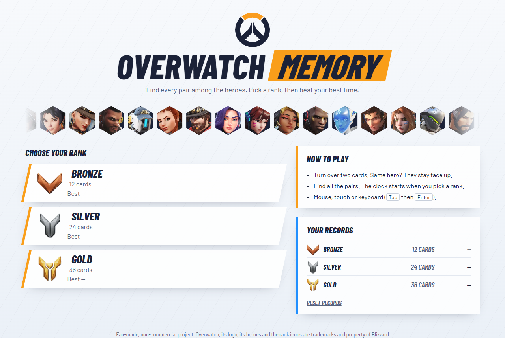
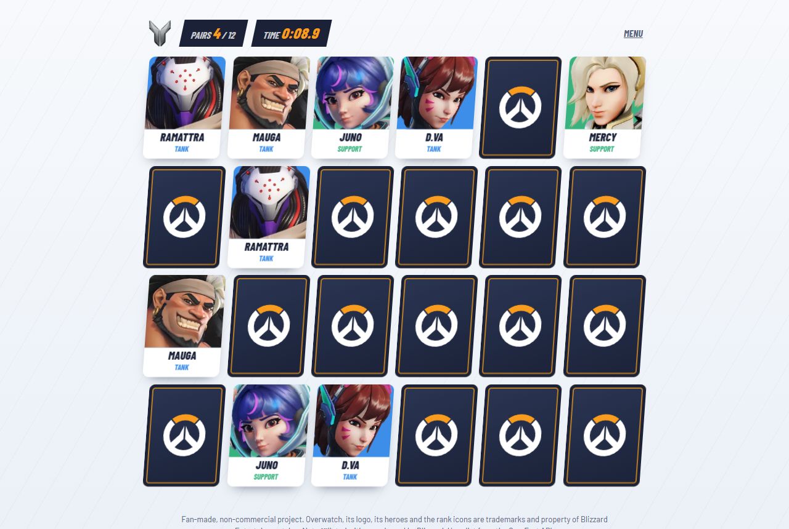

<div align="center">

# Overwatch Memory

A memory card game with the heroes of Overwatch.
Find every pair as fast as you can and beat your best time.

### [▶ Play in your browser](https://pedrofrmndss.github.io/css-overwatch-memory-game/)



</div>

## How to play

1. Pick a rank: **Bronze** (12 cards), **Silver** (24) or **Gold** (36).
2. Turn over two cards. Same hero? They stay face up. Otherwise they flip back.
3. Find all the pairs. The timer stops on the last one.
4. Try again to beat your record: your best time for each rank is saved.

It works with a mouse, on a touch screen, or with the keyboard (<kbd>Tab</kbd> then <kbd>Enter</kbd>).



## Features

- **53 heroes** with their official portraits, picked at random every game
- **3 ranks** with the official Overwatch 2 rank icons
- **3D card flips**, a short shake on a wrong pair, an orange flash on a match and a **VICTORY** screen
- **Timer** to the tenth of a second and **best time per rank**, kept in your browser
- Cards fade instead of rotating if your system asks for reduced motion

## How it works

The project is three files, with no framework and no build step:

| File | Role |
| --- | --- |
| `index.html` | The page: home, game board, victory screen |
| `style.css` | The design, the animations, and **the card logic** |
| `script.js` | Shuffles and builds the board, runs the timer, saves the records |

The part I found most interesting: **flipping the cards and checking the pairs is done in CSS, not
in JavaScript.**

Each card holds three `<details>` elements, but only one is visible at a time:

- **pick**: the card is turned first
- **miss**: the card is turned second, and it's not the pair
- **found**: the card is turned second, and it's the pair

A `<details>` is open or closed, so it can keep the state of the game. The CSS reads that state with
the `:has()` selector and decides what each card shows:

```css
/* When a card is turned, every other card now offers "miss"… */
.board:has(.pick[open]) {
  --show-pick: none;
  --show-miss: block;
}

/* …and the turned card flips over */
.card:has(.pick[open]) {
  --flipped: 1;
}
```

JavaScript only listens for a pair being found, to count the pairs and stop the timer.

## Run it locally

Download the project (**Code → Download ZIP**) and open `index.html` in a recent browser
(Chrome, Edge, Firefox or Safari). Nothing to install.

## Credits

Fan-made, non-commercial project. Overwatch, its logo, its heroes and the rank icons are trademarks
and property of Blizzard Entertainment, Inc. This project is not affiliated with or endorsed by
Blizzard.

- Hero portraits: [OverFast API](https://overfast-api.tekrop.fr/) (data from the official Overwatch website)
- Logo: [Wikimedia Commons](https://commons.wikimedia.org/wiki/File:Overwatch_circle_logo.svg)
- Rank icons: [Overwatch Wiki](https://overwatch.fandom.com/wiki/Category:Competitive_rank_badges)
